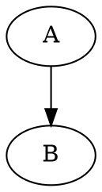
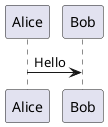

# 図表（Mermaid / Graphviz / PlantUML）

通常のフェンスコードブロックとして書きます。

````markdown





````

`plugins:` で無効化していない限り自動でレンダリングされます。Mermaid図をテキストと横並びにしたい場合は独自のレイアウト記法が使えます。

## PlantUML固有の注意点

- `@startuml` / `@enduml` を省略せず、実際のPlantUML構文どおりに書いてください（自動補完はしません）。
- レイアウトエンジンには純Java実装の Smetana を使うため、`dot`（Graphviz）等の外部バイナリは不要です。
- `plugins.plantuml: true` の場合、初回ビルド時にローカルのJava（11以上）を探し、見つからなければ Eclipse Temurin JRE を自動取得します（`tool_dir/.jre-cache/`にキャッシュ）。`plantuml.jar`（MIT版）も同様に初回のみ取得し`tool_dir/.plantuml-cache/`にキャッシュします。GitHub Actionsの`ubuntu-latest`にはJavaが標準搭載されているため、CI上では追加取得は発生しません。

````markdown
::: layout-right
左にこのテキスト、右に図が並びます。


:::
````

`::: layout-compare ... :::` は2つのMermaid図を左右に並べます（横長の図には不向き）。
