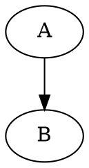
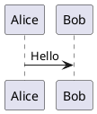

# 図表（Mermaid / Graphviz / PlantUML）

通常のフェンスコードブロックとして書きます。

````markdown





````

`plugins:` で無効化していない限り自動でレンダリングされます（`graphviz`/`mermaid`/`plantuml`とも既定`true`）。図をテキストと横並びにしたい場合や、2つの図を比較したい場合は独自のレイアウト記法が使えます。

## サイズ指定（width/height）

図は既定でページ幅・高さの上限（Mermaid/PlantUMLは12cm、Graphvizはページ幅）を超えないよう自動縮小されますが、拡大はされません。明示的にサイズを指定したい場合は、言語名の後ろに`{width=...}`/`{height=...}`を書きます。

````markdown


````

- `mermaid`/`plantuml`/`dot`/`graphviz`のいずれのフェンスでも使えます。`width`/`height`は片方だけでも両方でも指定できます。
- 値はTypstがそのまま解釈できる文字列（`50%`、`8cm`等）です。
- 明示指定すると自動縮小は働かなくなり、指定した値がそのまま使われます。**拡大も含めて指定どおりに反映される**ため、ページからはみ出さないかは自分で確認してください。
- 未指定の場合は従来どおり、はみ出さないよう自動で縮小されます（拡大はされません）。
- `layout-right`/`layout-left`/`layout-compare`内の図でも同じ記法が使えます。`layout-feature`内では、Markdown画像は写真用レイアウトの仕様上サイズ指定を無視して常に枠いっぱいに敷き詰められますが、Mermaid/PlantUML/Graphvizのフェンスは対象外（このレイアウトの想定用途ではない使い方）のため`{width=...}`/`{height=...}`がそのまま反映されます。

## ローカルにブラウザ／Javaが無い場合

MermaidはChrome/Edge、PlantUMLはJava（11以上）が必要です。システムに見つからない場合の挙動は`plugins.mermaid_auto_download`/`plugins.plantuml_auto_download`で制御します（「plugins: 図表プラグインの有効・無効」の章）。既定はMermaidがエラー終了、PlantUMLが自動取得（約50MB）と非対称です。**Mermaid側を`true`にすると、Playwright自身のChromium（約700MB）をダウンロードする**点に注意してください。GitHub Actionsの`ubuntu-latest`にはどちらも標準搭載されているため、CI上ではいずれも追加取得は発生しません。

## PlantUML固有の注意点

- `@startuml` / `@enduml` を省略せず、実際のPlantUML構文どおりに書いてください（自動補完はしません）。
- レイアウトエンジンには純Java実装の Smetana を使うため、`dot`（Graphviz）等の外部バイナリは不要です。
- `plantuml.jar`（MIT版）は初回ビルド時のみ取得し`tool_dir/.plantuml-cache/`にキャッシュします。Eclipse Temurin JREを自動取得した場合は`tool_dir/.jre-cache/`にキャッシュします。

````markdown
::: layout-right
左にこのテキスト、右に図が並びます。


:::
````

`::: layout-right`/`::: layout-compare`の中に置ける図は、Mermaidに限らずPlantUML・Graphviz（`dot`/`graphviz`フェンス）・Markdown画像（``、単独行のみ）のいずれも使えます。`::: layout-compare ... :::` は2つの図を左右に並べます（横長の図には不向き）。2つの種類を混在させる（例: 片方はMermaid図、もう片方は写真）こともできます。

図を左・テキストを右に置きたい場合は`layout-right`の左右反転版`layout-left`が使えます。中に置ける図の種類・書式は`layout-right`と同じです。

````markdown
::: layout-left
左に図、右にこのテキストが並びます。


:::
````

左右の比率を変えたい場合は、ブロック名の後ろに`{left=... right=...}`を付けます（例: `layout-right {left=30 right=70}`）。省略時は`layout-right`がテキスト35:図65、`layout-left`が図65:テキスト35です。数字は比率として扱われるだけなので、合計が100である必要はありません（`{left=3 right=7}`と`{left=30 right=70}`は同じ見た目になります）。片方だけ指定した場合、もう片方は省略時の既定値のままです。

````markdown
::: layout-right {left=30 right=70}
テキストを控えめに、図を広めに配置します。


:::
````

````markdown
::: layout-compare


:::
````

## layout-feature: 写真メイン＋キャッチコピー

写真（または図）をフルブリードで敷き、下部に半透明の帯とキャッチコピーを重ねるレイアウトです。表紙・扉スライドなどで使います。

````markdown
::: layout-feature


かんたん、そのまま。
:::
````

中に置ける図/画像は`layout-right`/`layout-compare`と同じくMermaid・PlantUML・Graphviz・Markdown画像のいずれも使えますが、想定用途はほぼ写真です。写真はMarkdown側の`alt|width=`指定に関わらず枠いっぱいに敷き詰められ（トリミングあり）、縦長・横長どちらの写真でも枠からはみ出しません。

想定している用途はスライド自体と同じ横長〜正方形に近い写真です。縦長写真を置くと上下がトリミングされます（枠の高さに収まるよう左右基準で拡大されるため）。縦長写真の全体を見せたい場合はこのレイアウトの対象外とし、通常のMarkdown画像として配置してください。

## layout-columns: 箇条書き等をN列に分割

中身（任意のMarkdown）をN列に流し込みます。列数は省略時2列、`layout-columns {n=3}`のように`{n=...}`を付けるとN列にできます。

````markdown
::: layout-columns
- 項目1
- 項目2
- 項目3
- 項目4
:::

::: layout-columns {n=3}
- Alpha
- Beta
- Gamma
- Delta
- Epsilon
- Zeta
:::
````

`layout-right`/`layout-compare`と異なり中身の種類は問わず、箇条書き以外（段落など）が混在してもエラーにはなりません。
