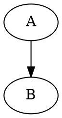

# 図表（Mermaid / Graphviz）

通常のフェンスコードブロックとして書きます。

````markdown



````

`plugins:` で無効化していない限り自動でレンダリングされます。Mermaid図をテキストと横並びにしたい場合は独自のレイアウト記法が使えます。

````markdown
::: layout-right
左にこのテキスト、右に図が並びます。


:::
````

`::: layout-compare ... :::` は2つのMermaid図を左右に並べます（横長の図には不向き）。
