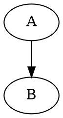
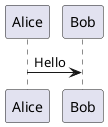

# 図表（Mermaid / Graphviz / PlantUML）

通常のフェンスコードブロックとして書きます。

````markdown





````

`plugins:` で無効化していない限り自動でレンダリングされます（`graphviz`/`mermaid`/`plantuml`とも既定`true`）。Mermaid図をテキストと横並びにしたい場合は独自のレイアウト記法が使えます。

## ローカルにブラウザ／Javaが無い場合

MermaidはChrome/Edge、PlantUMLはJava（11以上）が必要です。システムに見つからない場合の挙動は`plugins.mermaid_auto_download`/`plugins.plantuml_auto_download`で制御します（「plugins: 図表プラグインの有効・無効」の章）。既定はMermaidがエラー終了、PlantUMLが自動取得（約50MB）と非対称です。**Mermaid側を`true`にすると、Playwright自身のChromium（約700MB）をダウンロードする**点に注意してください。GitHub Actionsの`ubuntu-latest`にはどちらも標準搭載されているため、CI上ではいずれも追加取得は発生しません。

## PlantUML固有の注意点

- `@startuml` / `@enduml` を省略せず、実際のPlantUML構文どおりに書いてください（自動補完はしません）。
- レイアウトエンジンには純Java実装の Smetana を使うため、`dot`（Graphviz）等の外部バイナリは不要です。
- `plantuml.jar`（MIT版）は初回ビルド時のみ取得し`tool_dir/.plantuml-cache/`にキャッシュします。Eclipse Temurin JREを自動取得した場合は`tool_dir/.jre-cache/`にキャッシュします。

````markdown
::: layout-right
左にこのテキスト、右に図が並びます。


:::
````

`::: layout-compare ... :::` は2つのMermaid図を左右に並べます（横長の図には不向き）。
