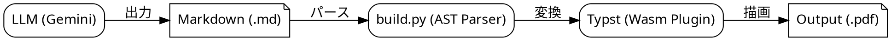

# 6. システムアーキテクチャ

本章ではシステムの全体構成について説明します。
以下の図は、AIが生成したGraphviz (dot記法) のアーキテクチャ図であり、外部依存なし（Wasm）でローカルに自動レンダリングされます。

```dot
digraph Architecture {
  rankdir=LR;
  node [shape=box, style=rounded, fontname="Yu Gothic"];
  
  AI [label="LLM (Gemini)"];
  Markdown [label="Markdown (.md)", shape=note];
  Python [label="build.py (AST Parser)"];
  Typst [label="Typst (Wasm Plugin)"];
  PDF [label="Output (.pdf)", shape=note];
  
  AI -> Markdown [label=" 出力"];
  Markdown -> Python [label=" パース"];
  Python -> Typst [label=" 変換"];
  Typst -> PDF [label=" 描画"];
}
```

このアプローチにより、開発環境へのJavaやNode.jsのインストールを避けたまま、実用的な図表を含むドキュメント生成が可能となります。
